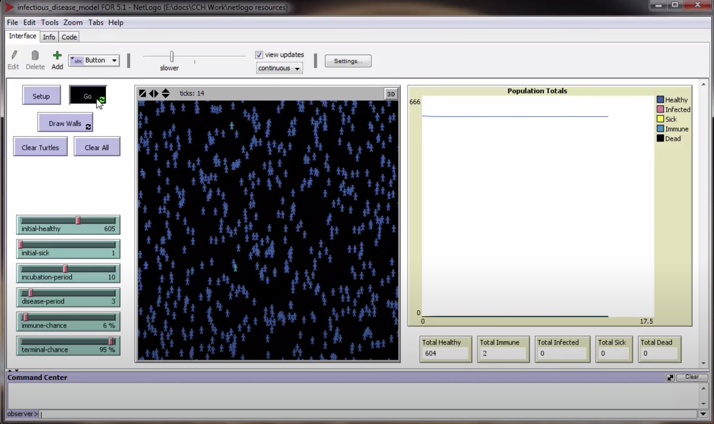

# Infectious Disease  Model

## WHAT IS IT?

This model simulates the spread of an infectious disease traveling via contact through a randomly moving population. The user can draw walls, buildings, or obstacles in the environment to simulate different environments.

## HOW IT WORKS

The agents wander randomly throughout the simulation grid. If a healthy agent occupies a patch with a sick or infected agent, the healthy agent has a chance to become infected. This is controled by the immune-chance slider. A healthy agent that does not become infected, becomes immune. An agent remains infected for a period determined by the incubation-period slider. During this time, the agent is contagious. Once the incubation period ends, the agent becomes sick. Sick agents remain contagious through the length of the disease period (controlled by the disease-period slider). At the end of the disease period, the agent either dies or recovers and becomes immune. This is determined by the terminal-chance slider.

## HOW TO USE IT
1. Use the Draw Walls button to create different landscapes for the agents to move around.
2. Set the initial healthy and sick populations.
3. Set the incubation and disease period to desired levels.
4. Set the chance for immunity and terminal illness.
5. Click Setup to populate the simulation grid.
6. Click Go to set the agents in motion.

Note: Click Clear Turtles to remove agents and leave landscape in place. Click Clear All to restart from scratch.

## EXTENDING THE MODEL
This model is for infectious disease that spreads via contact. Future models will show the progression of air-borne, food-borne and fixed source contact diseases.

##  CREDITS AND REFERENCES
This model was developed as a part of research work for The Center for Complexity in Health at Kent State University Ashtabula.